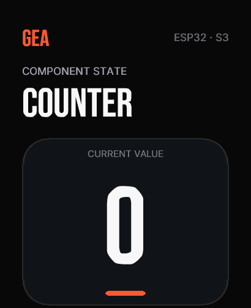

# 04 — Build and flash the composed target

There are three separate concepts:

| Concept | Where it lives | What it controls |
| --- | --- | --- |
| Chip driver | `@geastack/chips` | Reusable logic for one controller, independent of a board |
| Base target | `@geastack/targets` | Tested ESP-IDF, display, runtime, partition, build and flash integration |
| Custom target | your app's `.gea/targets/*.json` | The base to extend, exact driver selection, buses, and GPIO pins |
| Board alias | your app's `.gea/boards.json` | A short local name that selects the custom target and stores connection details |

This tutorial's custom target combines these hardware pieces:

| Role | Selection |
| --- | --- |
| MCU and radios | ESP32-S3 with built-in Wi-Fi and BLE |
| Display | CO5300, 410×502, QSPI |
| Touch | FT3168 over I²C |
| Power | AXP2101 |
| Motion | QMI8658 |
| Audio | ES8311 over I²S |

This snapshot contains the target produced in the previous step. Its `extends`
field selects the generic ESP32-S3 platform. The `chips` object selects the
driver for each hardware role, while `buses`, `storage`, and `controls`
describe the physical wiring.

During CMake configuration, `@geastack/targets` validates this file, turns the
chip names into the exact source list, and generates `board.h` in the project's
`.gea/build/manual-amoled/` output. Changing a pin in this JSON therefore
changes the C++ firmware configuration. Naming an unsupported chip stops the
build and reports the unsupported field.

The [`.gea/boards.json`](./.gea/boards.json) file connects that definition to
the local alias `manual-amoled`:

```json
{
  "manual-amoled": {
    "target": "manual-amoled",
    "targetDefinition": "targets/manual-amoled.json",
    "appPlatform": "esp32"
  }
}
```

The definition path is relative to `.gea/boards.json`. Connection details such
as a USB serial number or OTA host can also be stored under the alias later.

Build through the alias. Configuration validates every chip binding and GPIO,
then CMake compiles only the chosen native drivers:

```sh
cp .env.example .env
npm run check
npm run build
```

Enter the board's Wi-Fi credentials in `.env` before building. The ignored
file is inlined into the local firmware image and is never committed.

For the first USB flash, replace the example port with the board's actual
`/dev/cu.*` device:

```sh
npx gea flash --board manual-amoled --port /dev/cu.usbmodemXXXX --monitor
```

Because the app manifest enables BLE, this first flash also installs the BLE
OTA service for later wireless application updates.

Capture the framebuffer through the same board alias and USB connection:

```sh
npx gea screenshot counter.png --board manual-amoled --port /dev/cu.usbmodemXXXX
```

The command writes a PNG at the path you provide, so you can inspect the exact
pixels rendered by the board without a camera.



After this first USB installation, use BLE OTA for application updates:

```sh
npx gea ota --board manual-amoled --transport ble
```

The installed firmware also joins that Wi-Fi network and starts its HTTP OTA
server. Once you know the address printed by the serial monitor, Wi-Fi is the
fast path for subsequent updates:

```sh
npx gea ota --board manual-amoled --transport wifi --port 192.168.1.123
```

The catalog currently has ESP32 bindings for CO5300, FT3168, AXP2101,
QMI8658, and ES8311. A controller without an ESP32 binding remains visible in
`gea chips list`, but composition rejects it before starting a native build.
